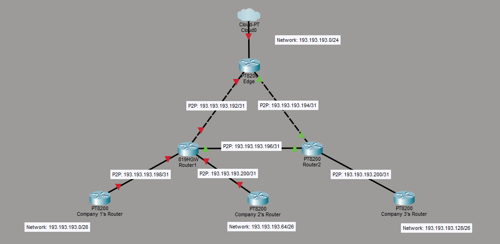

# IP Addresses

## MAC Addresses

"Media Access Control" address

Uniquiely identifies a device. One device (network interface) has one MAC address for it's whole life

MAC addresses alone would allow devices on a single network to communicate. It is not enough, however, to route traffic across multiple networks. That is where IPs come in.

- IPv4 and IPv6: It's like the address of an apartment
- MAC: It's like the exact floor and unit in the aparetment.

An IP can route to multiple hosts (broadcasting)

A host may respond to multiple IPs

But, each IP must only be assigned once.

## IPv4

A 32-bit address:

0111 1111.0000 0000.0000 0000.0000 0001 (in binary)

127.0.0.1 (in decimal)

 4,294,967,296 unique addresses possible

 There are 2 parts of an IPv4 address: The **Network Part**, and the **Host Part**. 
 
 For example, if the network is `192.168.0.0`and the netmask is `255.255.255.0` (only 256 hosts), and a host has the address `192.168.0.55` then `192.168.0` is the Network ID (all hosts on the network will have this as the first part of their address) and `55` is the Host ID.

 There used to be 5 classes of networks: A-E. A networks were very large, B were medium, and C were smaller:

 |Class|Range|Subnet Mask Equivalent|IPs Available|
 |-----|-----|----------------------|-------------|
 |A|`1.0.0.0 - 127.255.255.255`|`255.0.0.0`|16,777,214 + 2|
 |B|`128.0.0.0 - 191.255.255.255`|`255.255.0.0`|65,534 + 2|
 |C|`192.0.0.0 - 223.255.255.255`|`255.255.255.0`|254 + 2|
 |D|`224.0.0.0 - 239.255.255.255`|Multicast|Multicast|
 |E|`240.0.0.0 - 255.255.255.255`|reserved|reserved|

 This system meant that network size was determined by the first octet. If it was less than 128, then the size was 16 million IPs (the largest size here). Subnet masks were implied and automatically set based on this. However, there were problems with only having 3 size options. If you only needed 300 hosts on your network, you were stuck with having 65,534. This was abandoned in favor of configurable subnet masks (CIDR), which give more granular control over network size.

 The _default gateway_ of a network is a host on the network that is the network's link to other networks. It is common for the defualt gateway to have the first or last assignable address.

## Subnet Mask

Describes which bit positions within an IP address act as the **network part** and which bits act as the **host part**.

Manually setting a netmask allows for more granular control over network size than the class system above.

### Example:

- Network Address: 192.168.0.0
- Subnet Mask: 255.255.255.0
- **Network Part**: **192.168.0**.x
- **Host Part** (available host IP addressses): x.x.x.**1-254**
- The '0' in the subnet mask means that only that final octet is the "Host Part" of the address (the available IP addresses). IP addresses 1-254 are available in the network (with 0 being the Network Address, and 255 being the Broadcast Address)

### Another Example:

 In the last example, the netmask was a nice set of 255s and 0s. If there is a different number in one of the octets, calculating the available IP addresses is a little more complicated. We need to look at the binary forms of the octets.

- Network Address: 192.168.0.0
- Subnet Mask: 255.255.255.128

To figure out which part of this address is the Network Part, and which part is the Host part, we need to convert the address and netmask to binary:

- Binary Network Address: 11000000.10101000.00000000.00000000
- Binary Subnet Mask: 11111111.11111111.11111111.10000000

Note that the bits in the subnet mask are _contiguous_, that is, all the 1s are in a row, and all the 0s are in a row. In a subnet mask, the 1s are all at the beginning, and they represent the "network part" of IP addresses in the network. Os come after, and they represent the "host part".

These binary representations allow us to derive the **network part** and the **host part** of IP addresses on this network. The bits in and IP address where the corresponding bit in the subnet mask is a "1" are part of the network part of the address. The bits in an IP address where the corresponding bit in the subnet mask is a "0" are part of the host part of the address.

- Binary **Network Part**: **11000000.10101000.00000000.0**xxxxxxx
- Binary **Host Part** (Available host IP addresses): xxxxxxxx.xxxxxxxx.xxxxxxxx.x**0000001-1111110**

Lets convert this back to decimal:

- Decimal **Host Part** (Available host IP addresses): xxx.xxx.xxx.1-126

Since the last octet in the subnet mask was 128 (10000000) rather than 0 (00000000), the "host part" of our IP addresses got 1 bit smaller, effectively cutting our available IP addresses in half (from 254 to 126). Each bit we take away from the netowrk part of the address cuts the IP range in half again. If the last octet of the netmask was 192 (11000000), the IP range is now only 6 bits (62 available addresses, from 193-254).

You may also see another notation used for subnet masks called CIDR notation:

- Dotted Decimal Notation: 192.168.0.0/255.255.255.0
- CIDR Notation: 192.168.0.0/24

In CIDR notation, /24 is used as a shorthand for 255.255.255.0. This is possible because 255.255.255.0 contians 24 "1"s when converted to binary. 255.255.255.128 would be /25 in CIDR notation, because 255.255.255.128 contains 25 "1"s in its binary form.

### Special Subnets: /31 and /32

If you're following the logic of subnets, you'll notice that /31 only contain 2 addresses, and /32 networks only contain 1. These subnets have some special rules and use cases.

#### /31 Subnets

Since /31 subnets only have 2 addresses, they do not use network addresses or broadcast addresses. These subnets are called point-to-point links, and can only ever have 2 hosts. They are simply used to connect 2 hosts together, such as 2 routers.

#### /32 Subnets

/31 subnets only have a single address. These subnets (obviously) also do not use network or broadcast addresses. These are simply used as loopback addresses.

### Why Subnet?

#### ISPs allocating Public IPs

Pretend you are an ISP company called PearISP. IANA (the Internet Assigned Numbers Authority) has granted you a block of public IPs, 193.193.193.0/24. (This is a subnet of the entire internet). 193.193.193.0 is your network address, and 193.193.193.255 is going to be reserved as your broadcast address, but IP addresses 193.193.193.1 - 193.193.193.254 are yours to do with as you wish. You decide to assign 193.193.193.1 to your router at your headquarters.

A customer wants to buy internet services from you. You run cable to the customer's house, install a router at their house, and connect their router to a router at your headquarters. You then give this customer an IP address from your IP address pool, let's say 193.193.193.100. This becomes the customer's **public IP address**.

In practice, an ISP will never place their whole IP pool into a single subnet. Let's look at how they might subnet their network to sell off portions of their IPs.

PearISP has an edge router that is connected to the internet. The router carries all traffic to and from it's downstream routers. PearISP has 2 other routers as part of it's internal infrastructure. We need to create a separate subnet for each connection between these 3 routers. PearISP will sell the rest of the IPs to other smaller ISP companies. We create these three subnets:

|Network|Network/Netmask|Available Hosts|
|-------|---------------|---------------|
|Company 1's network|193.193.193.0/26|62|
|Company 2's network|193.193.193.64/26|62|
|Company 3's network|193.193.193.128/26|62|
|Edge -> Router1|193.193.193.192/31|2 (no network or broadcast address)|
|Edge -> Router2|193.193.193.194/31|2 (no network or broadcast address)|
|Router1 -> Router2|193.193.193.196/31|2 (no network or broadcast address)|
|Router1 -> Company 1 |193.193.193.198/31|2 (no network or broadcast address)|
|Router1 -> Company 2|193.193.193.200/31|2 (no network or broadcast address)|
|Router2 -> Company 3|193.193.193.202/31|2 (no network or broadcast address)|

These subnets allow for connections between routers within PearISP's infrastructure, and also allow PearISP to allocate sections of their IPs to other locations or companies.

[This Cisco Article](https://www.cisco.com/c/en/us/support/docs/ip/routing-information-protocol-rip/13788-3.html) Explains the use of subnets well.
