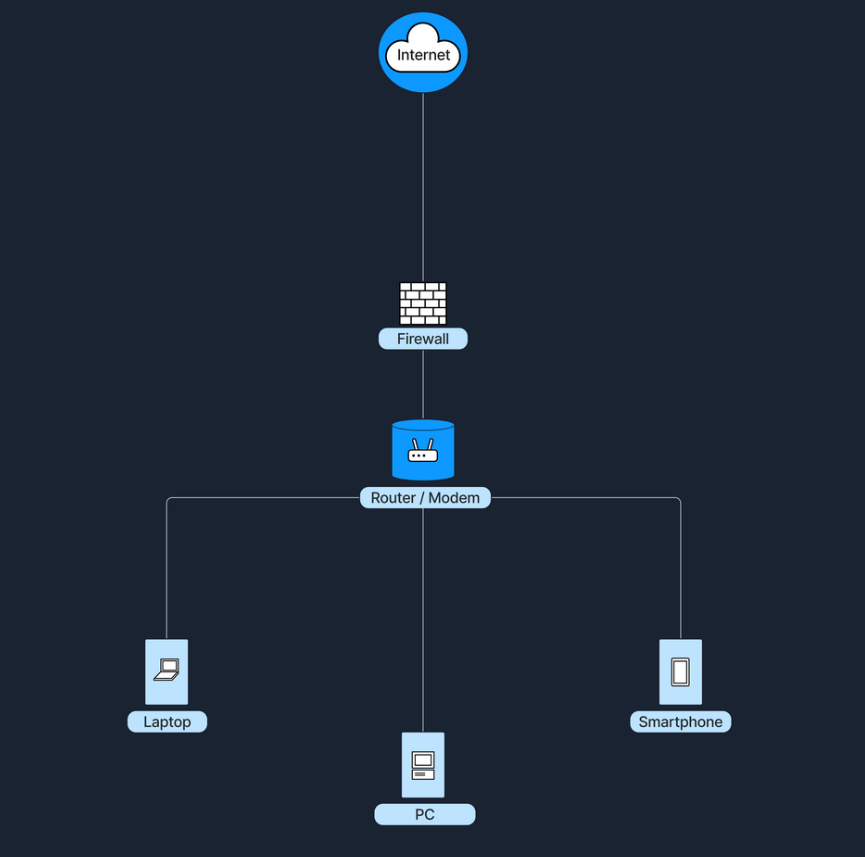
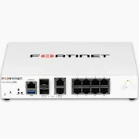

# Network Security

Within data, applications, and systems, uphold the CIA triad:

- C: Confidentiality
- I: Integrity
- A: Availability

## Firewalls

- Network security device
- Hardware or software (or combination)
- Enforce rules (policies/access control lists) to allow or block traffic
- Analyze each packet, determine which policies apply, and either allow or block
- Usually based on factors such as IP address, port numbers, and protocols
- Log traffic events and generate alerts about suspicious activity

### Types of Firewalls:

1) **Packet Filtering Firewall**

    - Layer 3 (Network) and Layer 4 (Transport) of the OSI Model
    - Simply examines IPs and protocols
    - **Example:** An ACL (Access Control List) that only allows HTTP (port 80) and HTTPS (port 443), and blocks all other ports

2) **Stateful Inspection Firewall**

    - Tracks the state of connections
    - Only allow inbound data that matches the previous outbound request
    - More intelligent than simple packet filtering

3) **Application Layer Firewall**

    - Layer 7 (Application) of OSI
    - Inspects content for malware
    - May block content containing suspicious patterns

4) **Next-Generation Firewall (NGFW)**

    - Stateful inspection + deep packet inspection, thread detection, and application-specific policies
    - Modern firewalls

A firewall is often build into the router/modem in a home environement.

Larger settings have a dedicated firewall device placed before the router in the traffic flow.

## Intrusion Detection/Prevention Systems (IDS/IPS)

- Monitor **and respond to** suspicious activity
- Intrusion Detection systems simply send alerts about activity, but don't block anything (Detect and Alert)
- Intrusion Prevention systems actually block suspicious traffic (Detect and Prevent)

### Techniques

1) **Signature-based:** Match traffic against known exploits
2) **Anomaly-based:** Compare traffic against "normal activity"

### Types of IDS/IPS

1) **Network-based IDS/IPS**
    
    - Hardware or software placed at specific points in the network to monitor all traffic

2) **Host-based IDS/IPS**

    - Runs on a single host (device)
    - Only monitors traffic on that device
    - **Example:** Antivirus software

IDS/IPS are typically placed in between the firewall and the router/modem

## Best Practices

1) **Define clear policies.** Only allow nessecary traffic
2) **Regular Updates.** Keep your software updated!
3) **Monitor Event Logs.** Identify suspicious patterns early.
4) **Layerd Security.** Defence in depth. Use many layers of protection (Firewall, IDS/IPS, antivirus, etc.)
5) **Periodic Penetration Testing.** Simulate real attacks.

