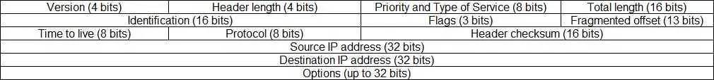

# Packets

- A message is chunked up into smaller "packets" and pieced back together when recieved
- This allows multiple deviced to take smaller turns using a cable
- A packet contains 2 sections: a Header and a Payload

## Parts of a packet

2 Parts: Header and Payload

### Packet Header

- Depends on the protocol being used
- Each packet contains at least an IP (internet protocol) header and another protocol (TCP, UDP, etc) in the 'data' portion corresponding to the IP header:
    
    ```
    //Example Packet

    Packet-|
           |-IP Header
                |-IP Header Data
           |-Data
                |-TPC Header
                    |-TCP Header Data
                |-Data (TLS Encrypted)
    ```

1) IP Header

    Resource: [study-ccna.com: IP Header](https://study-ccna.com/ip-header/)

    

    - **Version:** The verison of the IP protocol (probably 4 (IPv4) or 6 (IPv6))
    - **Header length** Length in 32 bit words. Minimum is 20, maximum is 60
    - **Priority and Type of Service:** How should the packet be handled? First 3 bits indicate priority.
    - **Total Length:** Length of the entire packet (header + data). Minimum is 20 bytes, maximum is 65,535 bytes
    - **Identification:** Differentiate between fragmented packets from types of datagrams
    - **Flags:** Used to control/idenify framents
    - **Framgmented offset:** Used to fragment and reassemble packets if to large for 1 frame
    - **Time to live:** (TTL). If data doesn't arrive before TTL expires, it is discarded.
    - **Protocol:** Defines protocol used in the data portion (TCP, UDP, etc)
    - **Header checksum:** Validates the integrity of the IP header (that it hasn't been tampered with in transmission)
    - **Source IP Address:** The IP of the sender
    - **Destination IP Address:** The IP of the reciever
    - **Options:** Other optional data for testing, security, etc. Usually empty.

2) TCP Header

    Resource: [cbtnuggets: What is the TCP Header](https://www.cbtnuggets.com/blog/technology/networking/what-is-tcp-header)

    

    - **Source and Destination Port Numbers:** The full address and port of the sender and reciever
    - **Sequence Number:** The which order this packet is to be read
    - **Acknowledgement Number:** Sent by the reciever back to the sender, acknowledges that a packet has been recieved
    - **DO (Data Offset)**: The size of the header, indicating where the next section of the packet starts
    - **Reserved:** Not yet used
    - **Flags:** Used to invoke certain TCP functions
    - **Window Size:** Indicates how large of a packet the reciever can handle at once
    - **Checksum:** A calculated hash value based on the sent contents. Used by the recipient to validate the integrity of the packet (that it has not been tampered with in transmission).
    - **Urgent Pointer:** Indicates whether the packet is urgent, and should recieve priority delivery
    - **Additional Options:** May be used for extra features, such as a timestamp, maximum segment size, etc. Only used when needed.

    #### Some TCP Flags:
    - SYN - "syncronization", used in the first step of the connection, include sequence number
    - ACK - "Acknowledgement", include sequence number
    - FIN - to request termination
    - RST - "reset", forced termination
    - URG - to make the data urgent
    - PSH - "push", used to request immediate data

## Packet vs Datagram

- Usually interchangeable
- "Datagram" is a segment sent over a network that contains enough information to be routed from source to destination on its own
- An IP packet is an example of a datagram
